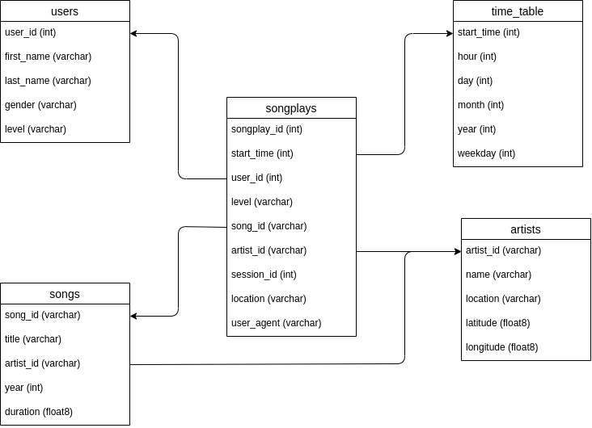

## Sparkify Datalake using S3 for Storage

The purpose of this project is to demonstrate how to create an ETL pipline using Apache Spark and S3(Simple Storage Service) to manage the data.

## Requirements

* spark-2.4.3-bin-hadoop2.6
* Python 3.6.15
* PIP Packages
  * Pyspark 2.4.3
  * Pandas
  * Jupyterlab

## ETL

There are two sets of logs that need to fit into the schema below. We have our song metadata stored as s3a://udacity-dent/song_data as a list of JSON files and our logs from the app stored at s3a://udacity-dent/log_data as a series of json files formated as ndjson.

The ETL process has two functions, 

First function, read the s3a://udacity-dent/song_data bucket and transform it into separate songs and artists dataframes saving it back to S3. This is done first because the other data in the data lake is dependent on on data in these tables. Save tables to new S3 bucket.

Second function, read the event data from s3a://udacity-dent/log_data parsing the independent data such as users and time into their own tables. Secondly read the songplay_table making sure to join the back to the song_id and artist_id from the tables created in the first function. Save tables to new S3 bucket.

## Eplanation of the files in the repository

* **etl.py**
  * As long as the right AWS credentials and S3 bucket names are input into this script it will run the entire ETL pipeline taking the events and songs and putting them into a datastructure in spark that coincides with the schema below
* practice folder
  * I saved my practice jupyter notebooks in this repo to showcase my thinking process. The modular_etl.ipynb notebook showcases getting the data from S3 into the right formats, practice_join.ipynb is where I troubleshooted the Spark join syntax.
* data
  * Contains template data to practice ETL pipeline, note current code does not support it

## Schema

